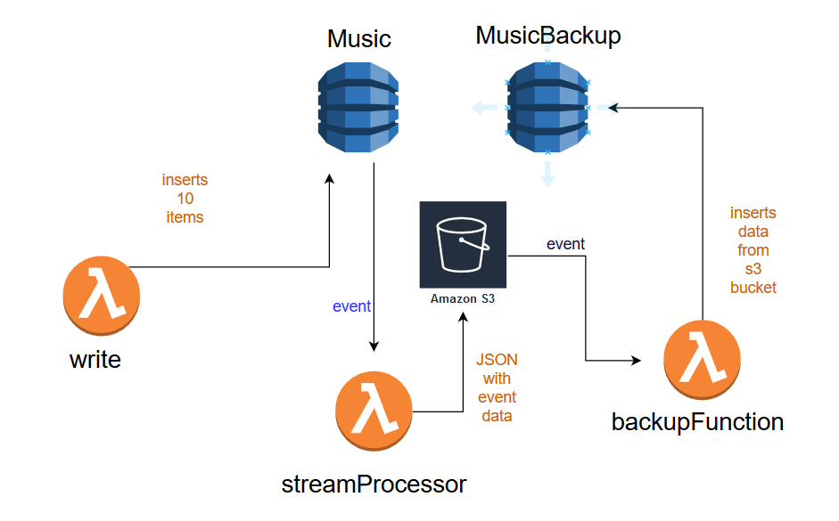

## Simple-AWS-Service

### How it works
1. write function inserts items in the Music table
2. Music table sends event stream to streamProssesor function
3. streamProcessor saves the stream in S3 bucket as a json file : data.json
4. S3 bucket sends event stream to backup function
5. backup is now fetching the data.json from the S3 bucket and parses the data
6. after the parsing the backup function updates the MusicBackup table with any changes

